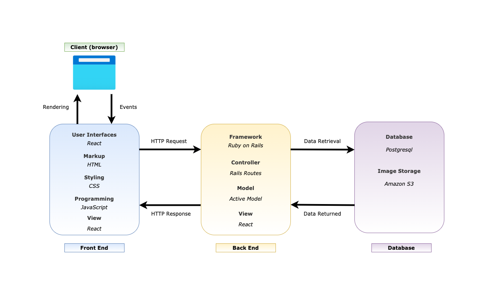

# **D & L Constructions**

## Collaborators

Sam Hammond | [GitHub](https://github.com/samhammond87) |  
Yee Ng | [GitHub](https://github.com/yee-codes) |  
Tracey Tran | [GitHub](https://github.com/Trac3yTranv) |  

#

## **Purpose**

The creation of the website serves the following purposes for the business:

- Establish an online presence
- Build reputation
- Market services provided with detailed description
- Reach potential customers in other parts of the city
- Easy way for customers to get in touch (contact form)
- Provide growth opportunities for the company
- Generate leads
- Visual portfolio of the projects the company has completed
- Provide a portal for company employees to log time sheets
- Provide payroll manager a way to track employee’s work hours to make payments

#
## **Functionality/Features**

**Staff Login with Authentication**

D & L Construction staff members will be given a username and password by management which can then be personalised by the individual staff member. Authentication has been added for an extra layer of security, as well as validation to ensure staff members receive a clear error message if they enter the wrong login details.

**Staff Dashboard**

Staff will be able to log their hours, view upcoming shifts, and submit their availability or application for leave from a simple dashboard that can be accessed through the main site.

**Admin Login with Authorisation**

Management will have a higher level of authorisation to allow staff member details to be updated, created and deleted.

**Unique Logo & Landing Page**

A modern, clean & eye-catching logo has been designed specifically for D & L Construction.  Users will be initially directed to a bold landing page that features the new logo, all of which has been designed to entice the user to explore the site more.

**Floating Navbar**

The site will feature a navigation bar that follows the user as they scroll down the website.

**Contact Us - Form & Links**

Forms have been created in order to simplify the user experience.  Any questions a user may have can be sent straight from the website with a confirmation email sent to the user.

**Projects Gallery & Testimonials**

Users will be able to glimpse past projects and quotes from satisfied customers.

**AWS S3 Image Upload**

AWS S3 services have been utilised for all images for.... 

**PostgreSQL:** The app utilises postgreSQL to store data

## **Target Audience**

The target audience are current and potential customers and all company employees.

#

## **Tech Stack**

**Frontend**

- HTML
- CSS
- JavaScript
- React framework

**Backend**

- Ruby on Rails
- Cors-react
- Devise
- CanCanCan

**Image Storage**

- Amazon S3

**Database**

- Postgresql

**Version/Source Control**

- Git
- Github

**Deployment**

- Heroku (back-end)
- Netlify (font-end)

**Project Management**

- Google Docs
- Trello
- Discord
- Draw.io

## **Dataflow Diagram**

## **Application Architecture Diagram**

#

## **User Stories**

- As a potential customer, I want to find out more about the business, so that I know that the company is trustworthy.
- As a potential customer, I want to know the range of services provided by the business, so that I know the company is a good fit for my project.
- As a potential customer, I want to see the projects the business has completed in the past, so that I can expect my project to be completed competently.
- As a potential customer, I want to contact the business, so that I can get a quote.
- As the payroll manager, I want to get the total work hours for each employee, so that I don’t have to calculate it manually.
- As the payroll manager, I want to get notifications when new work hours are logged, so that I don’t miss any wage payments.
- As the payroll manager, I want to be able to distinguish the work hours that have been processed and those that haven’t, so that I don’t overpay the employees.
- As an employee, I want to submit my timesheet with minimal effort, so that I don’t spend too much time doing this.
- As an employee, I want to know the status of my logged hours, so that I know that I will get paid.
- As an administrator, I want to create new logins, so that I can get the new employees to log their own work hours.
- As an administrator, I want to delete a login when an employee leaves the company, so that they no longer have access to the employee portal.
- As an administrator, I want to view all the activities in one page, so that I don’t have to go to different places for the information.
- As an administrator, I want to make an announcement in the portal, so that I don’t have to contact each employee individually.
- As a website visitor, I want to see if the company is hiring, so that I can apply for a job if there is a suitable position for me.

#

## **Wireframes**

#

## **Trello**

[Link to Part A Trello Board](https://trello.com/b/0mMP2DSZ/d-l-construction-full-stack-app-part-a)

[Link to Part B Trello Board](https://trello.com/b/rDfOx3BL/t3a2-b-full-stack-app-part-b)

Project Part A - Daily Plan 

Day 1

#
Day 2

#
Day 3

#
Day 4
