# **D & L Constructions**

## Collaborators

Sam Hammond | [GitHub](https://github.com/samhammond87)  
Yee Ng | [GitHub](https://github.com/yee-codes)  
Tracey Tran | [GitHub](https://github.com/Trac3yTran)  

#

## **Purpose**

The creation of the website serves the following purposes for the business:

- Establish an online presence
- Build reputation
- Market services provided with detailed description
- Reach potential customers in other parts of the city
- Easy way for customers to get in touch (contact form)
- Provide growth opportunities for the company
- Generate leads
- Visual portfolio of the projects the company has completed
- Provide a portal for company employees to log time sheets
- Provide payroll manager a way to track employee’s work hours to make payments

#

## **Functionality/Features**

**Staff Login with Authentication**

D & L Construction staff will be able to login with their email and a password received by management which can then be personalised by the individual staff member. Authentication has been added for an extra layer of security, as well as validation to ensure staff members receive a clear error message if the wrong login details are entered.

**Staff Dashboard**

Staff can log their work hours from a simple dashboard using a modern, responsive form that can be accessed through the main site.

**Admin Login with Authorisation**

Management have a higher level of authorisation allowing access to view and approve all timesheets submitted by staff.  Employee details can be created, updated, and deleted.

**Unique Logo & Landing Page**

A modern, clean & eye-catching logo has been designed specifically for D & L Construction.  Users are initially directed to a bold landing page that features the new logo, all of which has been designed to entice the user to explore the site more.

**Floating Navbar**

The site will feature a navigation bar that follows the user as they scroll down the website.

**Contact Us - Forms**

Any questions or comments a user may have can be sent straight from the website with a confirmation email sent to the user.

**Projects Gallery & Testimonials**

Users will be able to glimpse past projects and quotes from satisfied customers.

**AWS S3 Image Upload**

AWS S3 services have been utilised for all images on the website 

**PostgreSQL** 

The website utilises postgreSQL to store its data

#

## **Target Audience**

The target audience are current and potential customers and all company employees.

#

## **Tech Stack**

**Frontend**

- HTML
- CSS
- JavaScript
- React framework

**Backend**

- Ruby on Rails
- Cors-react
- Devise
- CanCanCan

**Image Storage**

- Amazon S3

**Database**

- Postgresql

**Version/Source Control**

- Git
- Github

**Deployment**

- Heroku (back-end)
- Netlify (font-end)

**Project Management**

- Google Docs
- Trello
- Discord
- Draw.io

#

## **Dataflow Diagram**
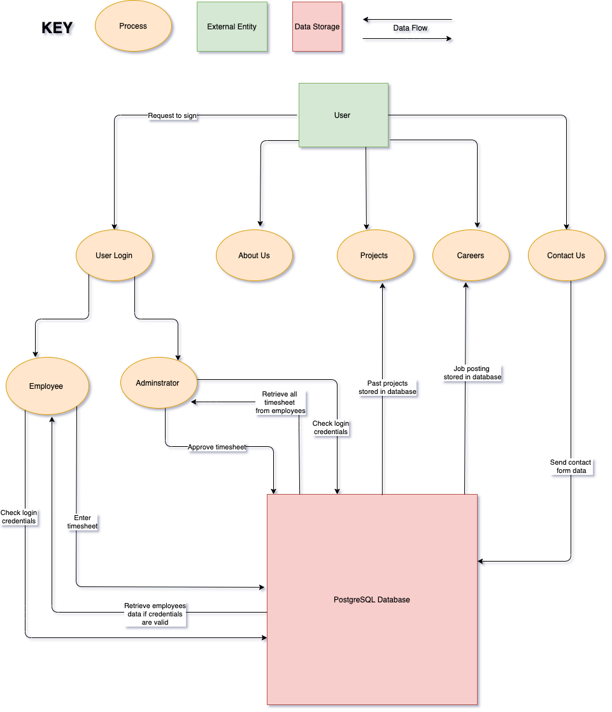

#

## **Application Architecture Diagram**
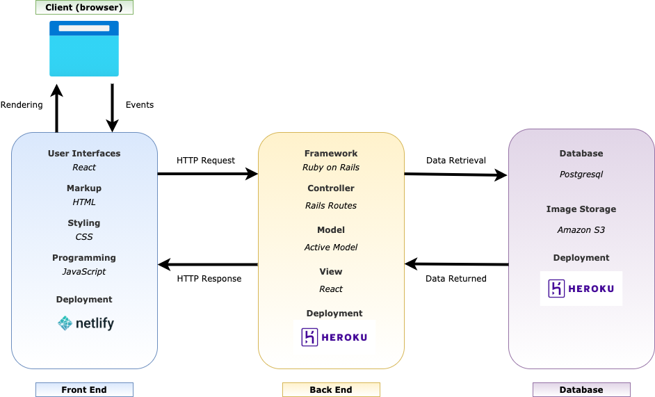

#

## **User Stories**

**The Owner**

The owner and his management team are hard workers that have brought the company great success in recent years.  Unfortunately, they lack the proper time to deal with employee paperwork, pay and communication. 

**As the owner, I want to:**

- View and approve all employee timesheets in one place so that I don't have to rifle through texts and emails.
- Receive the total work hours for each employee so I don't have to calculate it manually.
- I want to be able to distinguish between the work hours that have been paid, and those that are still pending.
- Create logins for new employees so that they can log their own hours.
- Delete logins when an employee leaves the company so that they no longer have access to the dashboard.
- Make announcements on the dashboard to allow all employees to be contacted so I don't have to contact them individually.

**The Client**

D & L Constructions clients live all across Sydney.  Anyone who is currently building in Sydney is a potential client, they have the time to shop-around and are constantly looking for the best work at the cheapest price.

**As a potential client, I want to:**

- Discover more about the business to gauge if the company holds a high standard of quality.
- Learn the range of services offered.
- See past projects so I know what my end product will look like.
- Contact the business to get a quote or ask a question.

**The Employee**

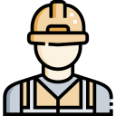

D & L Constructions have both employees and contractors. They are experienced tradespeople who's strengths have allowed them to succeed in a competitive industry.  However, their work is hard and once they've left the site the last thing they want to do is fill out more paperwork once they get home. 

**As an employee, I want to:**

- Submit a timesheet with minimal effort so I don't have to waste time once I'm already at home
- Know the status of my logged timesheets so that I can keep track of my finances.
- View any potential work that is on offer for full-time or contract positions.

#

## **Wireframes**

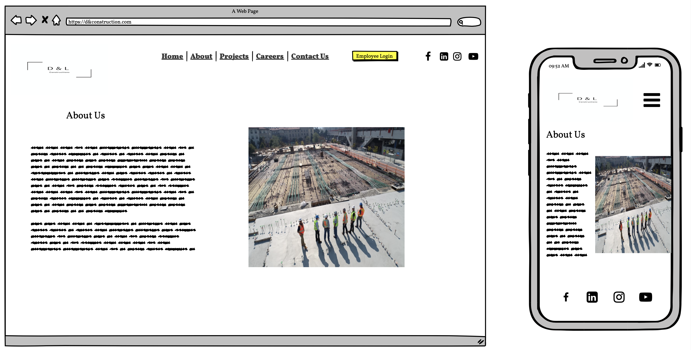

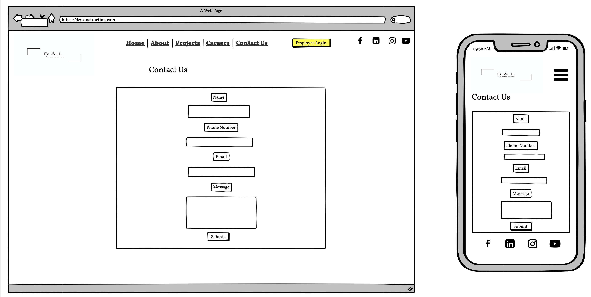
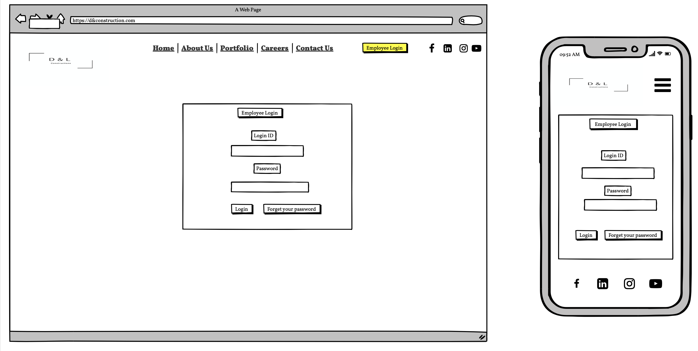
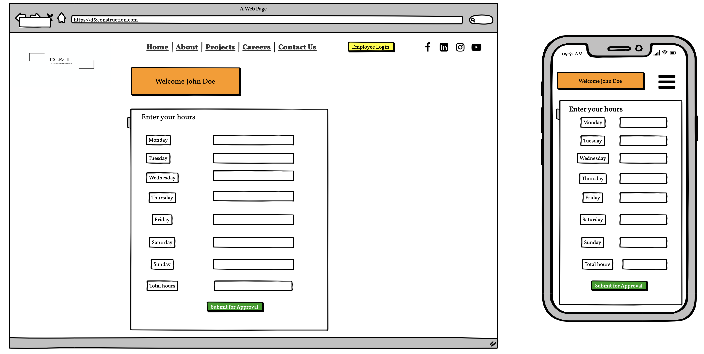
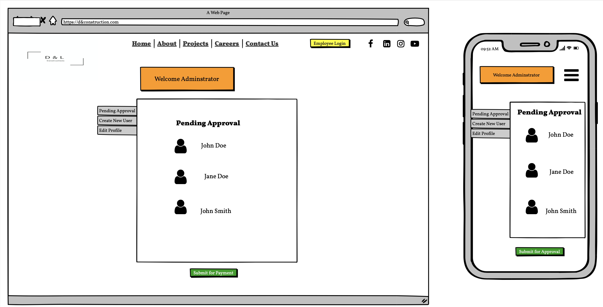

#

## **Trello**

[Link to Part A Trello Board](https://trello.com/b/0mMP2DSZ/d-l-construction-full-stack-app-part-a)

[Link to Part B Trello Board](https://trello.com/b/rDfOx3BL/t3a2-b-full-stack-app-part-b)

Day 1

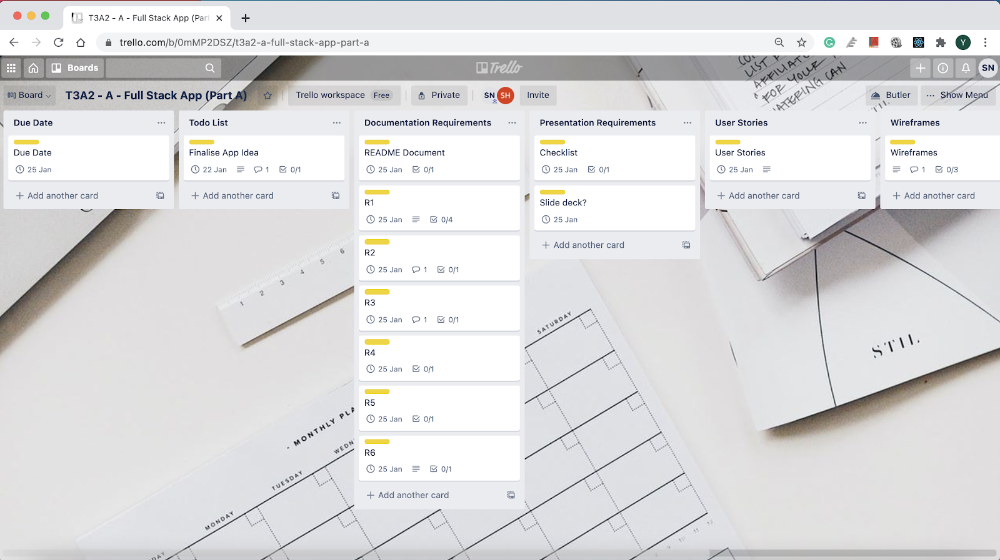

#

Day 2
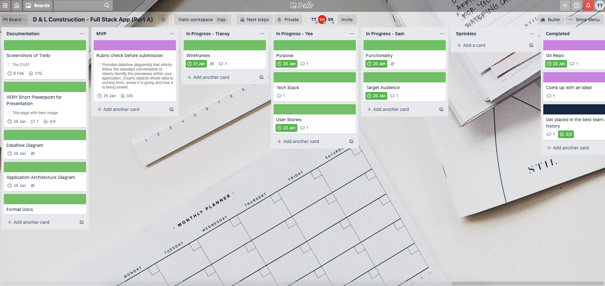

#

Day 3

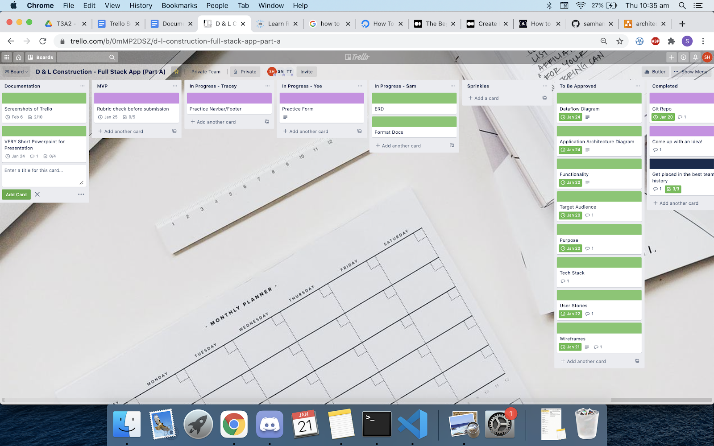

#

Day 4
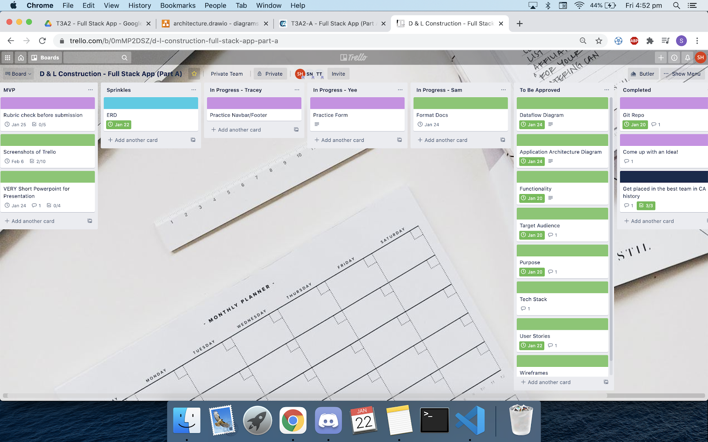
