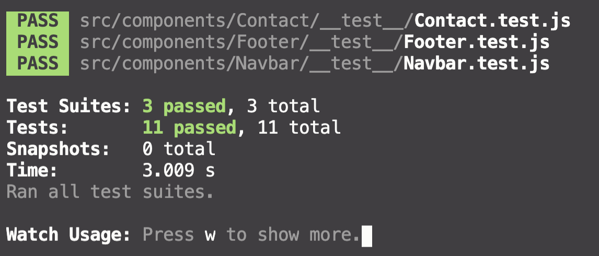

# **D & L Constructions**

## Collaborators

Sam Hammond | [GitHub](https://github.com/samhammond87)  
Yee Ng | [GitHub](https://github.com/yee-codes)  
Tracey Tran | [GitHub](https://github.com/Trac3yTran)  

#

## **Purpose**

The creation of the website serves the following purposes for the business:

- Establish an online presence
- Build reputation
- Market services provided with detailed description
- Reach potential customers in other parts of the city
- Easy way for customers to get in touch (contact form)
- Provide growth opportunities for the company
- Generate leads
- Visual portfolio of the projects the company has completed
- Provide a portal for company employees to log time sheets
- Provide payroll manager a way to track employee’s work hours to make payments

#

## **Functionality/Features**

**Staff Login with Authentication**

D & L Construction staff will be able to login with their email and a password received by management which can then be personalised by the individual staff member. Authentication has been added for an extra layer of security, as well as validation to ensure staff members receive a clear error message if the wrong login details are entered.

**Staff Dashboard**

Staff can log their work hours from a simple dashboard using a modern, responsive form that can be accessed through the main site.

**Admin Login with Authorisation**

Management have a higher level of authorisation allowing access to view and approve all timesheets submitted by staff. Employee details can be created, updated, and deleted.

**Unique Logo & Landing Page**

A modern, clean & eye-catching logo has been designed specifically for D & L Construction. Users are initially directed to a bold landing page that features the new logo, all of which has been designed to entice the user to explore the site more.

**Floating Navbar**

The site will feature a navigation bar that follows the user as they scroll down the website.

**Contact Us - Forms**

Any questions or comments a user may have can be sent straight from the website with a confirmation email sent to the user.

**Projects Gallery & Testimonials**

Users will be able to glimpse past projects and quotes from satisfied customers.

**AWS S3 Image Upload**

AWS S3 services have been utilised for all images on the website

**PostgreSQL**

The website utilises postgreSQL to store its data

#

## **Target Audience**

The target audience are current and potential customers and all company employees.

#

## **Tech Stack**

**Frontend**

- HTML
- CSS
- JavaScript
- React framework

**Backend**

- Ruby on Rails
- Cors-react
- Devise
- CanCanCan

**Image Storage**

- Amazon S3

**Database**

- Postgresql

**Version/Source Control**

- Git
- Github

**Deployment**

- Heroku (backend)
- Netlify (frontend)

**Project Management**

- Google Docs
- Trello
- Discord
- Draw.io

#

## **Dataflow Diagram**

## **Application Architecture Diagram**

#

## **User Stories**

**The Owner**

The owner and his management team are hard workers that have brought the company great success. Unfortunately, they lack the proper time to deal with employee paperwork, pay and communication.

**As the owner, I want to**

- View and approve all employee timesheets in one place so that I don't have to rifle through texts and emails.
- Receive the total work hours for each employee so I don't have to calculate it manually.
- I want to be able to distinguish between the work hours that have been paid, and those that are still pending.
- Create logins for new employees so that they can log their own hours.
- Delete logins when an employee leaves the company so that they no longer have access to the dashboard.
- Make announcements on the dashboard to allow all employees to be contacted so I don't have to contact them individually.

**The Client**

D & L Constructions clients live all across Sydney. Anyone who is currently building in Sydney is a potential client, they have the time to shop-around and are constantly looking for the best work at the cheapest price.

**As a potential client, I want to**

- Discover more about the business to gauge if the company holds a high standard of quality.
- Learn the range of services offered.
- See past projects so I know what my end product will look like.
- Contact the business to get a quote or ask a question.

**The Employee**

D & L Constructions have both employees and contractors. They are experienced tradespeople who's strengths have allowed them to succeed in a competitive industry. However, their work is hard and once they've left the site the last thing they want to do is fill out more paperwork once they get home.

**As an employee, I want to**

- Submit a timesheet with minimal effort so I don't have to waste time once I'm already at home
- Know the status of my logged timesheets so that I can keep track of my finances.
- View any potential work that is on offer for full-time or contract positions.

#

## **Wireframes**

#

## **Trello**

[Link to Part A Trello Board](https://trello.com/b/0mMP2DSZ/d-l-construction-full-stack-app-part-a)

[Link to Part B Trello Board](https://trello.com/b/rDfOx3BL/t3a2-b-full-stack-app-part-b)

Project Part A - Daily Plan

Day 1

#

Day 2

#

Day 3

#

Day 4

#

# Manual Testing logs

### Development Testing - Desktop API

Tested by Sajith Hewagama

 

| Type         | Task                                                   | Outcome | Comments                                                           |     |
| ------------ | ------------------------------------------------------ | ------- | ------------------------------------------------------------------ | --- |
| Authenticate | Employee can log in                                    | Success |                                                                    |     |
| Authenticate | Employee can log out                                   | Success |                                                                    |     |
| Authenticate | Admin can log in                                       | Success |                                                                    |     |
| Authenticate | Admin can log out                                      | Success |                                                                    |     |
| Authenticate | Admin can create new employee login                    | Success | Create button click area is too small                              |     |
| Search       | Employee can search by name                            | Success |                                                                    |     |
| Search       | Employee can search by date                            | Success |                                                                    |     |
| Search       | Admin can search by name                               | Success |                                                                    |     |
| Search       | Admin can search by date                               | Success |                                                                    |     |
| Create       | Employee can add new timesheet                         | Success |                                                                    |     |
| Create       | Admin can add new timesheet                            | Success |                                                                    |     |
| Read         | Employee can read all timesheets they created          | Success |                                                                    |     |
| Read         | Admin can read all timesheets created by all employees | Success |                                                                    |     |
| Update       | Employee can update their timesheet                    | Success | Prefer to have update and delete buttons to show on the index page |     |
| Update       | Admin can update any user timesheet                    | Success |                                                                    |     |
| Update       | Admin can update timesheet status                      | Success |                                                                    |     |
| Delete       | Employee can delete their own timesheet                | Success | Prefer to have update and delete buttons to show on the index page |     |
| Delete       | Admin can delete any timesheet                         | Success |                                                                    |     |

 

### Development Testing - Client Side Web

Tested by Andrew Bui

| Type                 | Task                                          | Outcome | Comments                                   |     |
| -------------------- | --------------------------------------------- | ------- | ------------------------------------------ | --- |
| Navbar               | Go to About us section                        | Success |                                            |     |
| Navbar               | Go to Services section                        | Success |                                            |     |
| Navbar               | Go to Why us? section                         | Success |                                            |     |
| Navbar               | Go to Careers section                         | Success |                                            |     |
| Navbar               | Go to Employee portal page                    | Success |                                            |     |
| Hero Section         | Background video auto play                    | Success |                                            |     |
| Hero Section         | Contact link go to the contact section        | Success |                                            |     |
| About Us Section     | Animation renders                             | Success |                                            |     |
| About Us Section     | Contact link go to the contact section        | Success |                                            |     |
| About Us Section     | AWS image renders                             | Success |                                            |     |
| Services Section     | Animation renders                             | Success |                                            |     |
| Services Section     | Contact link go to the contact section        | Success |                                            |     |
| Services Section     | AWS image renders                             | Success |                                            |     |
| Why Us Section       | Animation renders                             | Success |                                            |     |
| Why Us Section       | Contact link go to the contact section        | Success |                                            |     |
| Careers Section      | Contact link go to the contact section        | Success |                                            |     |
| Careers Section      | Animation renders                             | Success |                                            |     |
| Careers Section      | AWS image renders                             | Success |                                            |     |
| Contact Form Section | Alert pop when send message button is clicked | Success |                                            |     |
| Client Testimonials  | Carousel auto play after 5 seconds            | Success | Carousel takes more than 5 seconds to load |     |
| Client Testimonials  | AWS images render                             | Success |                                            |     |
| Footer               | Social media icons go to the external sites   | Success |                                            |     |

#

### Development Testing - Client Side Mobile

Tested by Andrew Bui

| Type                 | Task                                          | Outcome | Comments                                                                                     |     |
| -------------------- | --------------------------------------------- | ------- | -------------------------------------------------------------------------------------------- | --- |
| Navbar               | Go to About us section                        | Success |                                                                                              |     |
| Navbar               | Go to Services section                        | Success |                                                                                              |     |
| Navbar               | Go to Why us? section                         | Success |                                                                                              |     |
| Navbar               | Go to Careers section                         | Success |                                                                                              |     |
| Navbar               | Go to Employee portal page                    | Success |                                                                                              |     |
| Hero Section         | Background video auto play                    | Success |                                                                                              |     |
| Hero Section         | Contact link go to the contact section        | Success |                                                                                              |     |
| About Us Section     | Animation renders                             | Success | A known bug when animation renders there is an additional white space on the right hand side |     |
| About Us Section     | Contact link go to the contact section        | Success |                                                                                              |     |
| About Us Section     | AWS image renders                             | Success |                                                                                              |     |
| Services Section     | Animation renders                             | Success | A known bug when animation renders there is an additional white space on the right-hand side |     |
| Services Section     | Contact link go to the contact section        | Success |                                                                                              |     |
| Services Section     | AWS image renders                             | Success |                                                                                              |     |
| Why Us Section       | Animation renders                             | Success | A known bug when animation renders there is an additional white space on the right-hand side |     |
| Why Us Section       | Contact link go to the contact section        | Success |                                                                                              |     |
| Careers Section      | Contact link go to the contact section        | Success |                                                                                              |     |
| Careers Section      | Animation renders                             | Success | A known bug when animation renders there is an additional white space on the right hand side |     |
| Careers Section      | AWS image renders                             | Success |                                                                                              |     |
| Contact Form Section | Alert pop when send message button is clicked | Success |                                                                                              |     |
| Client Testimonials  | Carousel auto play after 5 seconds            | Success |                                                                                              |     |
| Client Testimonials  | AWS images render                             | Success |                                                                                              |     |
| Footer               | Social media icons go to the external sites   | Success |

#

### D&L Construction Deployed Website Screen Recording

[Youtube Link](https://youtu.be/ZdRCOwj5aMw)

 

# T3A2 - B - Full Stack App (Part B)

## Collaborators

- Sam Hammond | [GitHub](https://github.com/samhammond87)
- Shao Yee Ng | [GitHub](https://github.com/yee-codes)
- Tracey Tran | [GitHub](https://github.com/Trac3yTran)

### R1

#### At a minimum use the following technologies:

- Rails ✅
  - Used to build backend API
- React.js ✅
  - Used to build frontend components

### R2

#### Write well designed code that:

- Separates the program into modules that each deal with one particular focus, or concern ✅
  - Different components that make up the entire application are separated into individual folder and file (including styling) according to its function and features
  - E.g. nav bar has its own folder called 'Navbar' that stores the JavaScript and styling files
- Demonstrates DRY (Don’t Repeat Yourself) coding principles ✅
  - Code reviews have been performed regularly throughout the development process to sure the DRY principle is applied
- Uses appropriate libraries ✅
  - A variety of libraries have been utilised to develop the app (see further details below)
- Demonstrates good code flow control for user stories ✅
  - Utilising Agile project management methodology
  - Features and functionality of the app are developed according to planned user stories during the planning phase of the project to ensure the best user experience is achieved
- Applies Object Oriented (OO) principles/patterns ✅
  - Due to the declarative, component-based and learn once, write anywhere characteristics of React framework, Object Oriented principles is easily implemented to ensure the code is DRY and reusable
- Uses appropriate data structures ✅
  - Different data structures were considered and discussed during the planning phase, to ensure the appropriate data structures are used

### R3

#### Employ and utilise proper source control methodology (git) ✅

[Frontend Repository](https://github.com/yee-codes/d-l-constructions)
[Backend Repository](https://github.com/samhammond87/dlConstruction)

### R4

#### Demonstrate your ability to work in a team: ✅

[Trello](https://trello.com/b/rDfOx3BL/t3a2-b-d-l-construction-part-b)

- Use a recognised project management methodology ✅

  - Trello is used extensively throughout the development process; the board is reviewed daily at our morning team meeting (including weekends)

- Use a recognised task delegation methodology ✅
  - Tasks are assigned to each collaborator according to strengths and weaknesses
  - Throughout the entire process, newly acquired knowledge is shared among team members

### R5

#### Produce a working application that meets client and user needs ✅

- The client, Nick (company owner) is communicated with regularly to ensure app is built to meet business and internal staff needs
- Production site is tested by the client and approval has been received

### R6

#### Deploy the application to a cloud hosting service ✅

The end product is deployed to two cloud hosting services: Netlify (web app) and Heroku (backend API):

[D&L Constructions](https://dl-constructions.netlify.app/)

Att markers:

Please use the below admin/owner login credentials on the live site through Employee portal. e
Email address: nick@dl_constructions.com
Password: CoderAcademy

Admin can create employee or alternatively please use the below user login credentials to sign in
Email address: tracey@test.com
Password: CoderAcademy

### R7

#### Produce an application with an intuitive user interface ✅

[D&L Constructions](https://dl-constructions.netlify.app/)

### R8

#### Provides evidence of user testing:

- In the development environment ✅
  [Development Testing]()

- In the production environment ✅
  - [Production Testing]()

### R9

#### Utilises a formal testing framework ✅

- Unit tests performed using jest

Run `npm test` in the terminal.

### R10

#### A link (URL) to your deployed website ✅

[D&L Constructions](https://dl-constructions.netlify.app/)

### R11

#### A link to your GitHub repository (repo) ✅

Once both repos has been cloned

In Rails API [Backend Repository](https://github.com/samhammond87/dlConstruction) run:

- gem install
- rails db:create
- rails db:migrate
- rails db:seed
- rails s

In Client Side [Frontend Repository](https://github.com/yee-codes/d-l-constructions) run:

- yarn install
- yarn start
- Navigate to config/api.js
- Change baseURL 'http://localhost:3000'

### R12

#### The contents of your README.md as submitted for Full Stack App - Part A ✅

Please refer to the first section of this document.

### Rubric Check Brief & Summary

#### Demonstrate DRY (Don’t Repeat Yourself) principles in all code. ✅

...

#### Appropriate use of libraries used in the app ✅

- jest-dom
  - Used for performimg unit testing
- axios
  - Used to send HTTP requests
- bootstrap
  - Used provided classes to style certain components
- moment
  - Used to display date
- react-bootstrap
  - Used to improve productivity in the styling process
- react-icons
  - Used to import icons provided by the library
- react-moment
  - Used to display date
- react-scroll
  - Used to enable smooth scrolling on the website
- react-spring
  - Used to add animations for better user experience
- styled-components
  - Used to style React components in JavaScript file
  - Enable React components to be reusable without having to re-create the component and styling
- emailjs
  - Used to receive messages sent through the contact form

#### Demonstrate code flow control ✅

#### Apply Object oriented principles/patterns ✅

#### Demonstrate use of functions ✅

#### Utilises functions, ranges and classes ✅

#### Employ and utilise proper source control methodology ✅

#### Employ and utilise project management methodology ✅

#### App functionality ✅

#### Deployment ✅

#### User interface ✅

#### Development testing ✅

#### Production testing ✅

#### Utilises a formal testing framework ✅

#### Employ and utilise task delegation methodology ✅
