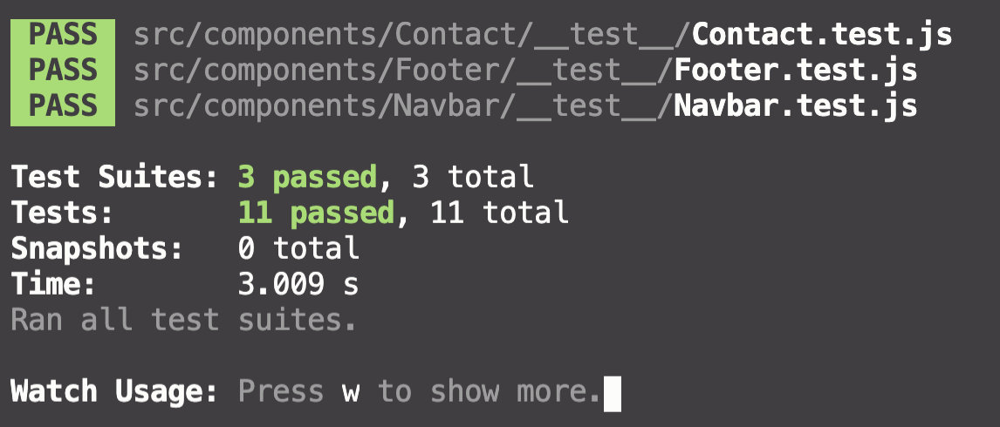

# T3A2 - B - Full Stack App (Part B)

## Collaborators

- Sam Hammond | [GitHub](https://github.com/samhammond87)
- Shao Yee Ng | [GitHub](https://github.com/yee-codes)
- Tracey Tran | [GitHub](https://github.com/Trac3yTran)

### R1

#### At a minimum use the following technologies:

- Rails ✅
  - Used to build backend API
- React.js ✅
  - Used to build frontend components

### R2

#### Write well designed code that:

- Separates the program into modules that each deal with one particular focus, or concern ✅
  - Different components that make up the entire application are separated into individual folder and file (including styling) according to its function and features
  - E.g. nav bar has its own folder called 'Navbar' that stores the JavaScript and styling files
- Demonstrates DRY (Don’t Repeat Yourself) coding principles ✅
  - Code reviews have been performed regularly throughout the development process to sure the DRY principle is applied
- Uses appropriate libraries ✅
  - A variety of libraries have been utilised to develop the app (see further details below)
- Demonstrates good code flow control for user stories ✅
  - Utilising Agile project management methodology
  - Features and functionality of the app are developed according to planned user stories during the planning phase of the project to ensure the best user experience is achieved
- Applies Object Oriented (OO) principles/patterns ✅
  - Due to the declarative, component-based and learn once, write anywhere characteristics of React framework, Object Oriented principles is easily implemented to ensure the code is DRY and reusable
- Uses appropriate data structures ✅
  - Different data structures were considered and discussed during the planning phase, to ensure the appropriate data structures are used

### R3

#### Employ and utilise proper source control methodology (git) ✅

[Frontend Repository](https://github.com/yee-codes/d-l-constructions)
[Backend Repository](https://github.com/samhammond87/dlConstruction)

### R4

#### Demonstrate your ability to work in a team: ✅

[Trello](https://trello.com/b/rDfOx3BL/t3a2-b-d-l-construction-part-b)

- Use a recognised project management methodology ✅

  - Trello is used extensively throughout the development process; the board is reviewed daily at our morning team meeting (including weekends)

- Use a recognised task delegation methodology ✅
  - Tasks are assigned to each collaborator according to strengths and weaknesses
  - Throughout the entire process, newly acquired knowledge is shared among team members

### R5

#### Produce a working application that meets client and user needs ✅

- The client, Nick (company owner) is communicated with regularly to ensure app is built to meet business and internal staff needs
- Production site is tested by the client and approval has been received

### R6

#### Deploy the application to a cloud hosting service ✅

The end product is deployed to two cloud hosting services: Netlify (web app) and Heroku (backend API):

[D&L Constructions](https://dl-constructions.netlify.app/)

### R7

#### Produce an application with an intuitive user interface ✅

[D&L Constructions](https://dl-constructions.netlify.app/)

### R8

#### Provides evidence of user testing:

- In the development environment ✅
  [Development Testing]()

- In the production environment ✅
  - [Production Testing]()

### R9

#### Utilises a formal testing framework ✅

- Unit tests performed using jest

Run `npm test` in the terminal.

### R10

#### A link (URL) to your deployed website ✅

[D&L Constructions](https://dl-constructions.netlify.app/)

### R11

#### A link to your GitHub repository (repo) ✅

[Frontend Repository](https://github.com/yee-codes/d-l-constructions)
[Backend Repository](https://github.com/samhammond87/dlConstruction)

### R12

#### The contents of your README.md as submitted for Full Stack App - Part A ✅

Please refer to the first section of this document.

### Rubric Check Brief & Summary

#### Demonstrate DRY (Don’t Repeat Yourself) principles in all code. ✅

...

#### Appropriate use of libraries used in the app ✅

- jest-dom
  - Used for performimg unit testing
- axios
  - Used to send HTTP requests
- bootstrap
  - Used provided classes to style certain components
- moment
  - ???
- react-bootstrap
  - Used to improve productivity in the styling process
- react-icons
  - Used to import icons provided by the library
- react-moment
  - ???
- react-scroll
  - Used to enable smooth scrolling on the website
- react-spring
  - Used to add animations for better user experience
- styled-components
  - Used to style React components in JavaScript file
  - Enable React components to be reusable without having to re-create the component and styling
- emailjs
  - Used to receive messages sent through the contact form

#### Demonstrate code flow control ✅

#### Apply Object oriented principles/patterns ✅

#### Demonstrate use of functions ✅

#### Utilises functions, ranges and classes ✅

#### Employ and utilise proper source control methodology ✅

#### Employ and utilise project management methodology ✅

#### App functionality ✅

#### Deployment ✅

#### User interface ✅

#### Development testing ✅

#### Production testing ✅

#### Utilises a formal testing framework ✅

#### Employ and utilise task delegation methodology ✅
